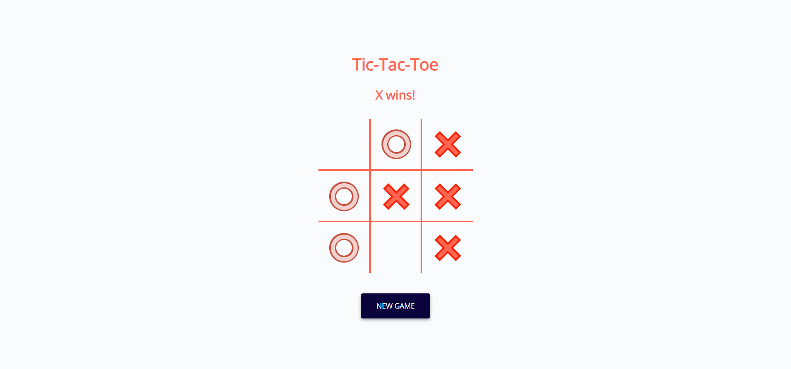

  

<h1 align="center">
  Tic Tac Toe
</h1>

<h3 align="center">
  Game Development
</h3>

  

Tic Tac Toe is a classic two-player game where each player takes turns marking a 3x3 grid with their symbol, either X or O. The objective of the game is to get three of your symbols in a row, either horizontally, vertically, or diagonally, before your opponent does.
To play the game, simply click on the box in the grid where you want to place your symbol. The game will alternate between X and O symbols for each player's turn. If a player gets three of their symbols in a row, they win the game. If all nine squares on the grid are filled and there is no winner, the game ends in a draw.
  
The interface of our tic tac toe game is simple and user-friendly. The game board is displayed prominently in the center of the screen, with each square of the grid clearly marked and easy to click on. At the top of the screen, there is a button to start a new game whenever the user wants to play again.
In addition to the game board, there are also visual indicators to show whose turn it is and who has won the game. When it is a player's turn, their symbol will be highlighted at the top of the screen. If a player wins the game, a message will be displayed on the screen declaring them the winner. If the game ends in a draw, a message will be displayed stating that the game is a draw.
We hope you enjoy playing our tic tac toe game and have fun competing against your friends and family!

  
<!-- ................................................................................................................................. -->

### Features
 
Following are some of the new features and learning encountered while creating this amazing project:

- <b>Two-player game:</b>  The game is designed for two players to play against each other.
- <b>Simple gameplay:</b>  The game has simple rules and is easy to understand, making it accessible to players of all ages and skill levels.
- <b>3x3 grid:</b>  The game is played on a 3x3 grid, with each player taking turns to mark a box with their symbol.
- <b>Win conditions:</b>  The objective of the game is to get three of your symbols in a row, either horizontally, vertically, or diagonally, before your opponent does.
- <b>Draw condition:</b>  If all nine squares on the grid are filled and there is no winner, the game ends in a draw.
- <b>User-friendly interface:</b>  The game interface is designed to be simple and easy to use, with clearly marked boxes on the grid that are easy to click on.
- <b>New game button:</b>  There is a button to start a new game whenever the user wants to play again, making it easy to reset the game board and start a new match.
- <b>Visual indicators:</b>  The game has visual indicators to show whose turn it is and who has won the game, making it easy for players to keep track of the game's progress.

</b>
Overall, the Tic Tac Toe game is a simple yet fun game that is perfect for quick matches with friends and family. It has all the features needed to provide an enjoyable and engaging gaming experience.

  
<!-- ................................................................................................................................. -->

### Demo

  The Demo of this working project can be found on  
  <a href="https://rebrand.ly/TicTacToe_MABCORP">rebrand.ly/TicTacToe_MABCORP</a>

  
<!-- ................................................................................................................................. -->

### Video

You can exclusively watch the video on this project from the making to deploying on my     channel with the link given below 

  [Video Link](# )  

  If you like my video then do Like the Video and share it with others.

  
<!-- ................................................................................................................................. -->

### Gaming Interface  

  
<!-- ................................................................................................................................. -->

### Technology Stack
 
Follwing technologies have been used at the core of this application to make it stand in the market place:

- HTML
- CSS
- JavaScript

  
<!-- ................................................................................................................................. -->

### Advancement

> Nothing Recommended Yet

  
<!-- ................................................................................................................................. -->

### Deployment Details

The website is deployed using the free hosting provided by **Vercel**

  

  
Later on the link was customized using the well-known URL shortener and customizer **Rebrandly**:  

  

  
<!-- ................................................................................................................................. -->

### Developer

Muhammad Abdullah Butt  
abdullahbutt12292210@gmail.com  
> [Instagram](https://www.instagram.com/abdullah.butt.22/) 
> [FaceBook](https://www.facebook.com/profile.php?id=100076291614529) 
> [YouTube](https://www.youtube.com/channel/UCnuOFQyMywg-KuoN-lmav1Q) 
> [Portfolio](https://rebrand.ly/MuhammadAbdullahButt_MABCORP) 
> [Project Displayer]( https://rebrand.ly/ProjectDisplayer_MABCORP)
  
<!-- ................................................................................................................................. -->

